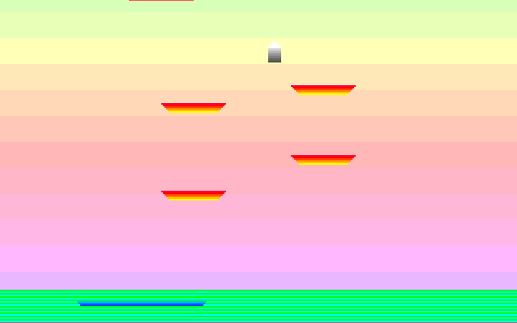
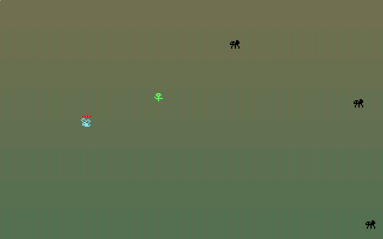
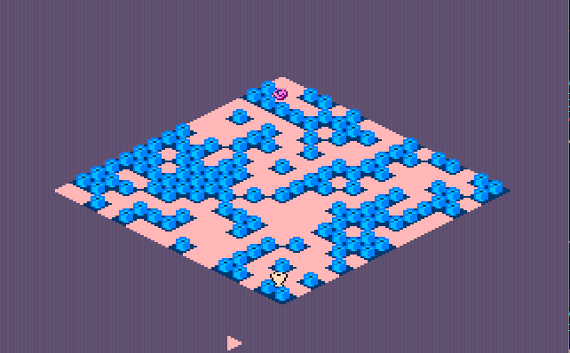
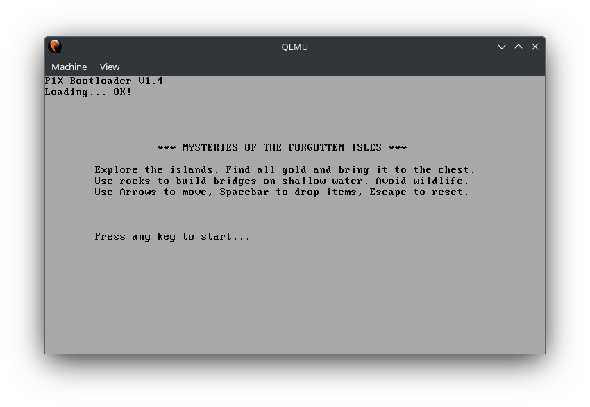
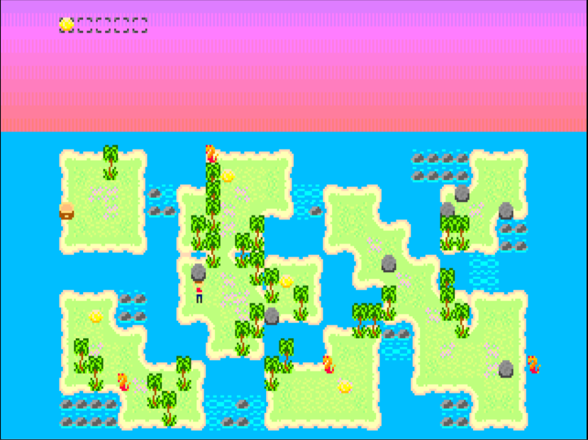

# x86 Assembly Programs for x86 CPUs

A list of game and programs made mostly for bare-metal BIOS x86 environment.
All you need to run is a floppy disk drive and boot from the provided image.

## Bootsector (512b) / No Operating System Games
- game1 - released - Land Me - arcade avoid obstacles
- game2 - abandoned - Ganja Farmer 512b - port of DOS game
- game3 - released - Fly Escape - animated sprites
- game4 - abandoned
- game5 - abandoned - custom palettes experiments
- game6 - released - Bit of a Treasure - isometric logic game, procedural levels

## DOS (2Kb)
Programs up to 2Kb (2048b) for DOS. FreeDOS and MS-DOS, COM files.
Mouse driver may be required.
- game7 - released - Moth Hunter - mouse use
- game8 - abandoned - Unnamed - 2-bit sprites, smooth movment
- game9 - abandoned - Dinopix - meta-tiles, sprite mirroring, 2-bit sprites use

## BIOS (2Kb) / No Operating System Games
- boot - released - custom bootloader with game title/description
- game10 - in-production - The X Project - Mysteries of the Forgotten Isles

# Released Projects

## Land Me - 512b/Boot sector

## Game 3 - 512b/Boot sector

## Game 6 - 512b/Boot sector

## Game 7  - 512b/DOS

# In-Production Projects

## The X Project - Mysteries of the Forgotten Isles

### Bootloader - 512b/firts, boot sector

### The Game - 2048b/four sectors

Game10 is my current state-of-the-art engine. Includes all the features of previous games, all the tricks, and prooven solutions. 

Game is developed on Debian (ThinkPad X220), tested in QEMU and IBM PC (Intel Celeron M, 1GHz, 2GB RAM), booted from a floppy.

#### Main features

- 16-bit Assembly, FLAT assembler
- no operating system need, runs on bare-metal x86 IBM compatible:
    - 486 DX2 66MHz, 1MB RAM
- 512 bytes for custom bootloader with game instructions
- 2048 bytes for game code, four floppy sectors
- custom bootloader with game title + description (short!)
- keyboard input support
- VGA graphics:
    - 320x200
    - 256 colors
    - double-buffering
    - v-sync
- sprites/tiles:
    - 2-bit, 4 color sprites (with transparency)
    - custom palettes (GameBoy Color style)
- map:
    - made of 16x8 meta-tiles
    - meta-tile made of 2x2 tiles
    - 32x16 gameplay grid
- entities system:
    - 64 max
    - simple interactions (building bridge using rock)
    - simple AI, random move at the moment
    - simple compression of data (grouped by ID)
    - z-sorting (you can hide behind a tree)
    - player entitie can move objects
- supprorting game tools (HTML5):
    - [2-bit Paint](https://smol.p1x.in/2bitpaint/)
    - [Meta-Tiles Level Editor](https://smol.p1x.in/metaleveleditor/)

### Enchanced Edition - 4096b/eight sectors

This version will include more maps, intro/outro, enchanced sprites, animations, better sound effects, more enemies.

#### Already added features:

- spider entitie - catches user in a web, slowing down movement
- ship sprite
- intro with moving ship

