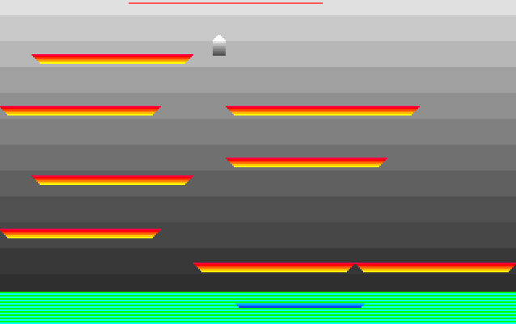

# x86 Assembly Programs

## Bootsector (512b) / No Operating System Games

This image size is exactly 512 bytes. Same as the limit of bootsector programs.

## Game 1




### This is the whole game.


## Game 2


## Download floppy image and run
- Game 1 [floppy.img](bootsector/game1/floppy.img)
- Game 2 [floppy.img](bootsector/game2/floppy.img)
- Run in emulator (online) https://copy.sh/v86/ or boot on real hardware (x86)
- Examine image in https://hexed.it/


### Prequisite for building
- QEMU (x86_64)
- NASM

### Build & Run
```
$ cd bootsector/
$ ./build-and-run.sh game1
```

#### Game 1 Versions
I saved few revisions on branches:
- master - current bleeding edge
- simple - a simple platformer with 4 levels
- girl-animated - 3 frame animated sprite and 1 level
- coins - coins detection and collection


