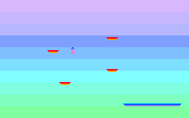

# x86 Assembly Programs

## Bootsector (512b) / No Operating System Games

This image size is exactly 512 bytes. Same as the limit of bootsector programs.


### Prequisite for building
- QEMU (x86_64)
- NASM

### Online Tools
- https://copy.sh/v86/ - to run the game in browser (floppy.img)
- https://hexed.it/ - to examine code

### Build & Run
```
$ cd bootsector/
$ ./build-and-run.sh game
```


#### Game 1 Versions
I saved few revisions on branches:
- master (current bleeding edge)
- game-1-simple (simple platformer)
- girl-animated-512b (with animated sprites)
- coins (coins detection and collection)
