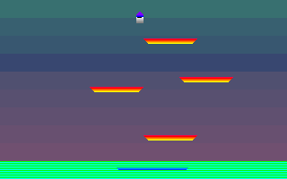
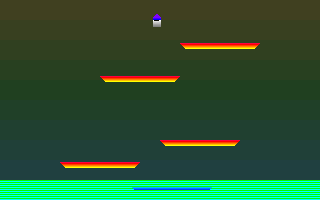
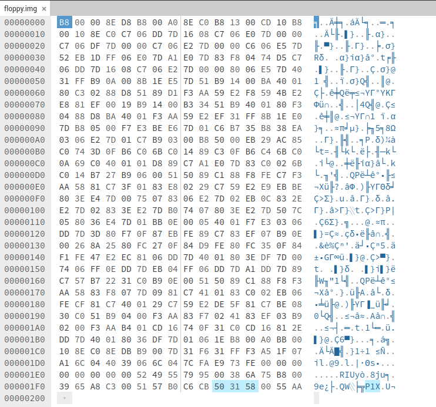

# x86 Assembly Programs

## Bootsector (512b) / No Operating System Games

This image size is exactly 512 bytes. Same as the limit of bootsector programs.


### Prequisite for building
- QEMU (x86_64)
- NASM

### Online Tools
- https://copy.sh/v86/ - to run the game in browser (use [game1.img](bootsector/floppies/game1.img), [simple.img](bootsector/floppies/simple.img) or [girl-animated.img](bootsector/floppies/girl-animated.img) floppy images)
- https://hexed.it/ - to examine binary

### Build & Run
```
$ cd bootsector/
$ ./build-and-run.sh game
```





This is the whole game.


#### Game 1 Versions
I saved few revisions on branches:
- master - current bleeding edge
- simple - a simple platformer with 4 levels
- girl-animated - 3 frame animated sprite and 1 level
- coins - coins detection and collection


