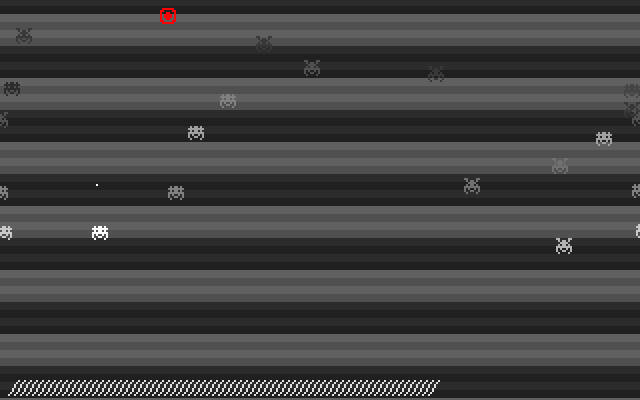
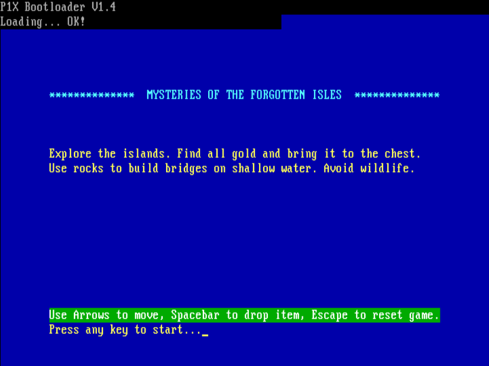

# x86 Assembly Programs for x86 CPUs

A list of game and programs made mostly for bare-metal BIOS x86 environment.
All you need to run is a floppy disk drive and boot from the provided image.

## Bootsector (512b) / No Operating System Games
- game1 - released - Land Me - arcade avoid obstacles
- game2 - abandoned - Ganja Farmer 512b - port of DOS game
- game3 - released - Fly Escape - animated sprites
- game4 - abandoned
- game5 - abandoned - custom palettes experiments
- game6 - released - Bit of a Treasure - isometric logic game, procedural levels

## DOS (2Kb)
Programs up to 2Kb (2048b) for DOS. FreeDOS and MS-DOS, COM files.
Mouse driver may be required.
- game7 - released - Moth Hunter - mouse use
- game8 - abandoned - Unnamed - 2-bit sprites, smooth movment
- game9 - abandoned - Dinopix - meta-tiles, sprite mirroring, 2-bit sprites use

## BIOS (2Kb) / No Operating System Games
- boot - released - custom bootloader with game title/description
- game10 - in-production - The X Project - Mysteries of the Forgotten Isles

# Released Projects

## Land Me - 512b/Boot sector

## Game 3 - 512b/Boot sector

## Game 6 - 512b/Boot sector

## Game 7  - 512b/DOS

# In-Production Projects

## The X Project - Mysteries of the Forgotten Isles

### Bootloader - 512b/firts, boot sector

### The Game - 2048b/four sectors

Game10 is my current state-of-the-art engine. Includes all the features of previous games, all the tricks, and prooven solutions. 

Game is developed on Debian (ThinkPad X220), tested in QEMU and IBM PC (Intel Celeron M, 1GHz, 2GB RAM), booted from a floppy.

Main features:
- 16-bit Assembly, FLAT assembler
- no operating system game, runs on bare-metal x86 BIOS (i486+)
- 512 bytes for bootloader, 2048 bytes for game code
- custom bootloader with game title + description (short!)
- keyboard input support
- PC speaker support
- VGA graphics, 320x200
- double-buffering and v-sync
- 2-bit, 4 color sprites (with transparency), custom palettes (GameBoy Color style)
- tiles and meta-tiles for levels
- entities system with simple behaviours
- simple compression of entities data (grouped by ID)
- z-sorting for all entities (you can hide behind tree)
- player entitie can interact with other entities, move objects
- simple AI for entities, randome move at the moment
- super primitice sound effects at the moment
- supprorting game tools (HTML5): [sprite editor](), [level editor](https://smol.p1x.in/metaleveleditor/)
