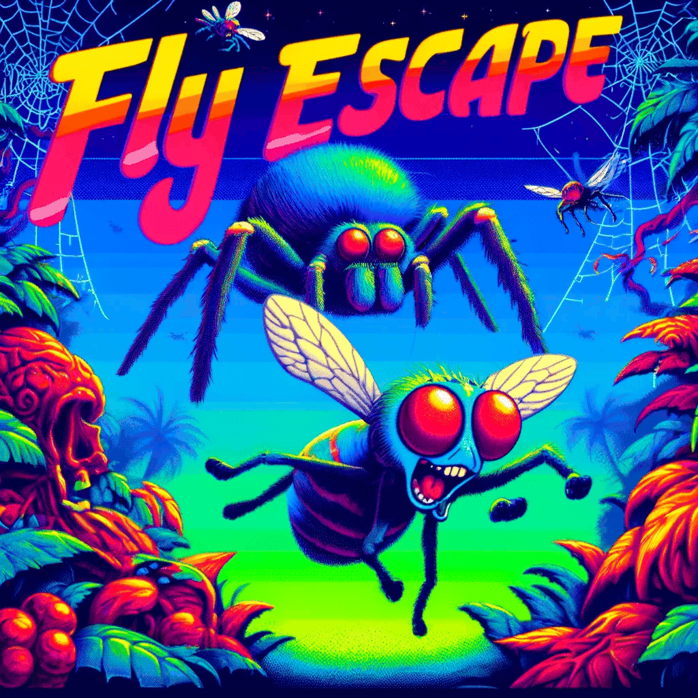
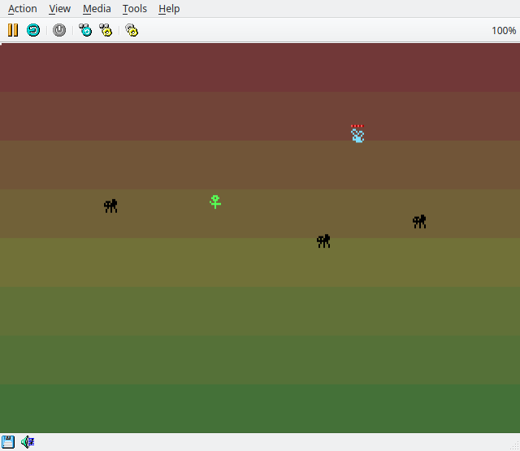
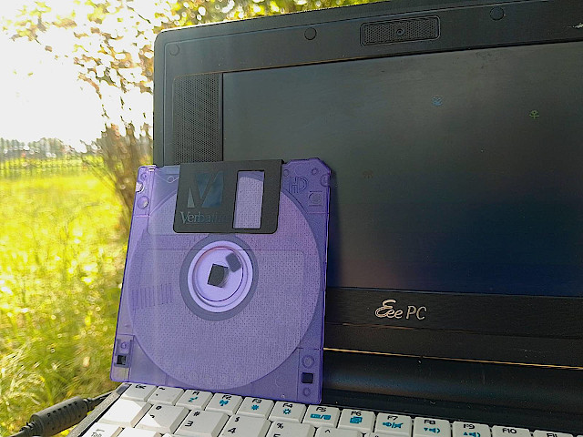
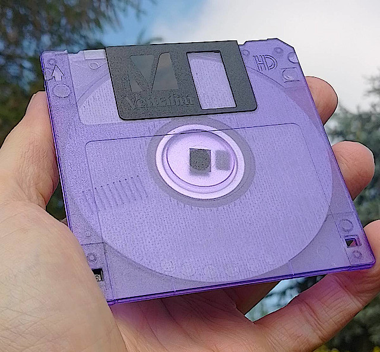

# Game 3 - Fly Escape

# Fly Escape

Fly Escape is a boot sector game developed by Krzysztof Krystian Jankowski ^ P1X, released version 1.0 on May 18, 2024. The game runs on Intel 386 processors in 16-bit real mode and features a simple yet engaging gameplay experience in a VGA 320x200x256 graphics mode. The objective of the game is to control a fly, avoid spiders, and collect flowers to advance through levels.

## Features

- VGA Graphics: Runs in 320x200 resolution with 256 colors.
- Double Buffering: Smooth rendering with minimal flickering.
- Player Control: Control a fly, avoiding spiders and collecting flowers.
- Randomized Levels: Entity positions and rotations are pseudo-randomly generated.
- Collision Detection: Accurate pixel-based collision detection.
- Multiple Levels: Progress through increasing levels of difficulty.
- Life System: Start with 4 lives; lose a life when colliding with spiders.
- Entity Types: Different entities with unique behaviors:
    - Spiders: Dangerous enemies to avoid.
    - Flowers: Collect these to advance to the next level.
- Animated sprites: Three sprites each 8x7 pixels in 2 frames
- Level and live indicator: Dots in top-left of the screen and a line under fly.
- Keyboard Controls: Rotate the fly to navigate through the game environment.
- Compact Size: Entire game fits within a 512-byte boot sector.

# Getting Started

## Prerequisites

- Intel 386 processor or emulator
- Floppy disk or emulator capable of booting from a 512-byte boot sector
- Tested on:
    - QEMU i386
    - 2007: Asus EeePC 701 (real floppy)
    - 86Box: 
        - 1987: IBM PS/2 Model 80, 386 16Mhz, 2MB Ram (Works perfectly fine!)
        - 1984: IBM AT, 268 6Mhz, 256KB RAM (Slow, but playable)

## Download

- [Floppy Image](https://raw.githubusercontent.com/w84death/x86-assembly/main/bootsector/game3/floppy.img)
- [Floppy Image for 286](https://raw.githubusercontent.com/w84death/x86-assembly/main/bootsector/game3/floppy_286.img)
- [Source Code](https://raw.githubusercontent.com/w84death/x86-assembly/main/bootsector/game3/game3.asm)

## Installation

- Write the game to a bootable floppy disk or configure your emulator to boot from the provided game image.
- Insert the floppy disk into your system or configure the emulator to use the game image.
- Boot the system from the floppy disk or emulator to start playing the game.

# Controls

Arrow Keys: Rotate the fly to navigate the screen.

# Gameplay

- Objective: Control the fly, avoid spiders, and collect flowers.
- Lives: You start with 4 lives. Colliding with a spider decreases your life by one. If you lose all lives, the game restarts. Line under fly indicates lives left.
- Level Progression: Collect flowers to advance to the next level. Each new level spawns more enemies, increasing the difficulty. Current level number indicated by a dots on a top-left corner of the screen.

# Code Structure

- Memory and Constants Setup: Defines VGA memory addresses, game parameters, and constants.
- Bootstrap (_start): Initializes VGA mode and sets up double buffering.
- Game Initialization (restart_game): Sets initial player life and level, clears entities.
- Level Initialization (next_level): Sets player position, spawns entities.
- Main Game Loop (game_loop): Contains the core game logic.
- Draw Background (draw_bg): Renders the game background.
- Draw Entities (draw_entities): Draws and updates entities on the screen.
- Collision Checking (check_collisions): Detects and handles collisions.
- Player Movement (handle_player): Updates and renders player position.
- Keyboard Input (handle_keyboard): Processes player input for controlling the fly.
- VGA Blit (vga_blit): Copies double buffer content to VGA memory.
- Delay Timer (delay_timer): Implements delay for game speed control.
- Drawing Sprite (draw_sprite): Subroutine to draw sprites on the screen.
- Data Definitions: Contains movement lookup table and sprite data.

# License

This project is open-source and available under the MIT License. Feel free to use, modify, and distribute the code as per the license terms.

# Acknowledgements

- Developed by Krzysztof Krystian Jankowski ^ P1X
- Inspired by classic 8-bit and 16-bit era games

Enjoy playing Fly Escape and challenge yourself to reach the highest level!