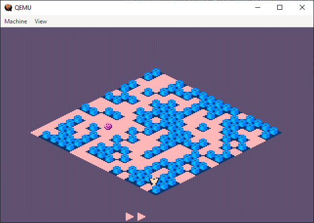

# BIT OF A TREASURE

## Overview
The game involves navigating a player character through a level to collect a treasure while avoiding collisions with non-movable tiles. The game features simple but effective isometric graphics to create a pseudo-3D effect.

## Gameplay
Collect the treasure and avoid the walls. Swap level designs to find the best path.

## Screenshot

### Key Features
- **Isometric Graphics**: The game employs isometric projection to create a 3D-like visual experience using 2D sprites.
- **VGA Mode**: Utilizes 320x200 pixels VGA mode with 256 colors.
- **Keyboard Controls**: Basic keyboard input is used to control the player character.
- **Double Buffering**: Implements double buffering to reduce flickering and provide smoother animations.

## Controls: 
- Arrow keys - move the player
- Enter - toggle level designs (4 in total)
- ESC - restart the game after failed move

## Technical
- The game is written in x86 assembly language and runs in 16-bit real mode.
- The game uses VGA 320x200x256 colors mode, doublebuffering.
- Minimum CPU is Intel 386.
